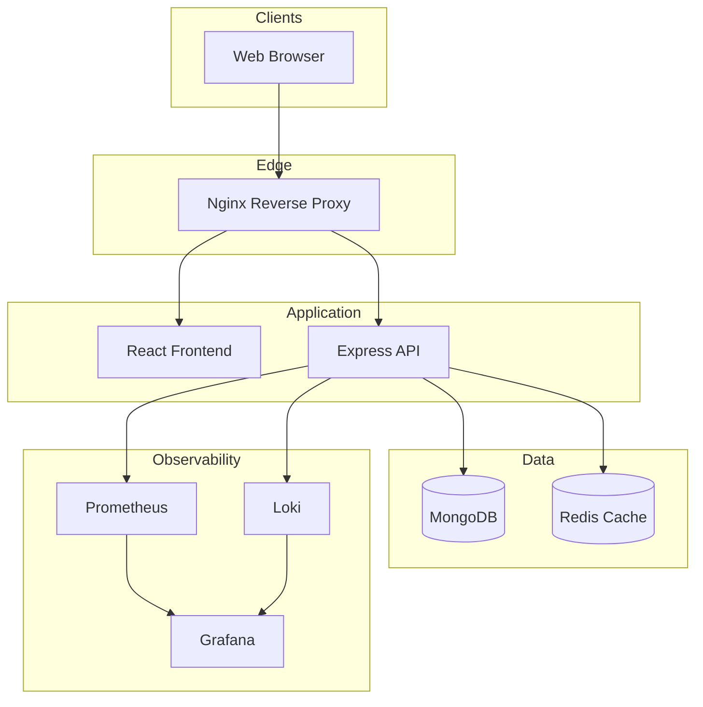

# Architecture

## High-Level Architecture

## Components

| Layer | Technology | Purpose |
|-------|------------|---------|
| Frontend | React, TypeScript, Tailwind, Zustand | Role-based dashboards |
| API | Express, JWT, RBAC | REST business logic |
| Database | MongoDB | Persistent data |
| Cache | Redis | Sessions, caching |
| Proxy | Nginx | Load balancing, routing |
| Metrics | Prometheus + Grafana | API latency, errors, CPU |
| Logs | Loki + Promtail | Centralized logging |

## Microservice-Ready Design

The monolith is modularized into domain services (auth, students, subjects, enrollment, attendance, marks) with clear boundaries for future extraction.

## Deployment Targets

- **Local**: `docker-compose up`
- **Kubernetes**: Manifests + Helm charts
- **Cloud**: Terraform provisions AWS EKS + ALB
