# DevOps Workflow

```mermaid
flowchart LR
    Dev[Developer] -->|feature branch| Git[GitHub]
    Git -->|PR| CI[GitHub Actions]
    CI -->|pass| Merge[Merge to develop/main]
    Merge -->|main push| Build[Docker Build]
    Build -->|push| Registry[Docker Hub]
    Registry --> CD[CD Pipeline]
    CD --> K8s[Kubernetes Cluster]
    K8s --> Mon[Prometheus/Grafana]
```



## Branch Strategy

| Branch | Purpose |
|--------|---------|
| `main` | Production releases (semver tags) |
| `develop` | Integration branch |
| `feature/*` | New features |
| `fix/*` | Bug fixes |

## Commit Convention

```
feat: add attendance export
fix: resolve JWT refresh race
ci: update Trivy scan
docs: deployment guide
```

## Release Process

1. Merge to `main`
2. Tag `v1.0.0` (see `VERSION`)
3. CI builds and pushes images
4. CD deploys to K8s with rollback on failure
